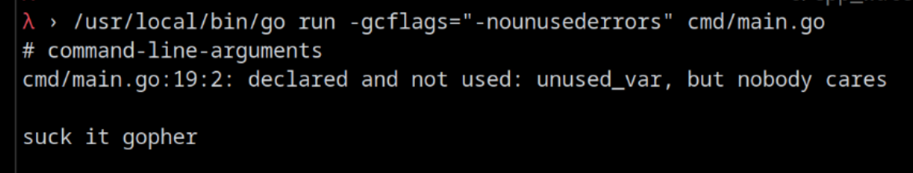

# Compile from source (Linux)
Clone:
```sh
git clone --depth=1 https://github.com/valeratrades/go-warn-unused /tmp/go-warn-unused \
&& cd /tmp/go-warn-unused/src
```

Build:
```sh
./all.bash \
&& sudo cp -f ../bin/go /usr/local/bin/go
```

Saves the compiled binary as `/usr/local/bin/go`

# Usage
```sh
/usr/local/bin/go run -gcflags="-nounusederrors" ${target_file}
```

## Implementation Status
- [x] compile and run
- [ ] update AST token parsing
